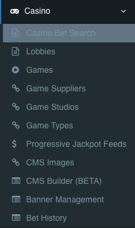
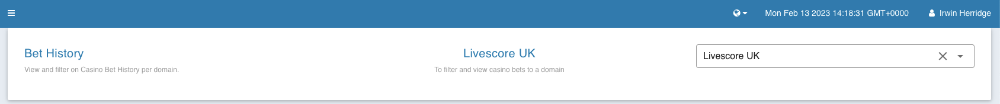

= LSPLAT-10986 PLAT-12031 Casino Bet History Page
Irwin Herridge <irwin.herridge@wonderlabz.com>
1.0, Feb 13, 2022: Casino Bet History Page
:sectnums:
:toc: left
:toclevels: 4
:toc-title: Table of contents
:icons: font
:url-quickref: https://docs.asciidoctor.org/asciidoc/latest/syntax-quick-reference/
:table-caption!:

:erd-include: ../includes/erd.puml
:seq-include: ../includes/sequence.puml

:svc-user-sourcedir: ../../service-user/service-user/src/main/java

//This is done to keep formatting aligned with gitlab
****
[verse,,]
____
link:../../readme.adoc[Home]
____
****

== Description
=== Jira
* link:https://playsafe.atlassian.net/browse/LSPLAT-10986[LSPLAT-10986]
* link:https://livescoregroup.atlassian.net/browse/PLAT-12031[PLAT-12031]

=== Gitlab
* Branch: origin/feature/LSPLAT-10986_PLAT-12031_Casino_Bet_History_Page
* MR: link:https://gitlab.com/playsafe/lithium/app-lithium-full/-/merge_requests/6331[]

=== External Dependencies
==== Swagger (To be completed *before* development starts)
* Short description of swagger changes that will be required.
* TL to facilitate timeline and communication to GW/FE for the changes.

N/A

==== DWH
* Short description of any changes that would need to be communicated/discussed with DWH.
* TL to facilitate.

N/A

==== Other
* Any other external providers that might need consideration. e.g. eXtremePush/Roxor

N/A

=== Business

If Comps Engines fails we need to be able to look up players who have qualified for a Promotion by checking who placed qualifying bets between certain dates.

Data Fields https://docs.google.com/spreadsheets/d/1kgfV2CJyPRlnplmkLMmq3RB-LclqyXOiJkYlzgr11lM/edit#gid=0[Casino bet History fields]

|===
|Field |Priotity |Comments

|Bet Date
|Needed in V1
|

|Game
|Needed in V1
|

|Game Supplier
|Needed in V1
|

|Game Type
|Needed in V1
|

|Bet Status
|Needed in V1
|

|Stake
|Needed in V1
|

|Return
|Needed in V1
|

|Round Status
|Needed in V1
|

|Settled date
|Needed in V1
|

|Bet Round GUID
|Needed in V1
|

|Game Provider
|Needed in V1
|

|user ID
|Needed in V1
|

|Username
|Needed in V1
|

|Bet Status
|Needed in V1
|

|Domain
|Needed in V1
|

|App/Web
|Not urgent
|

|Currency
|Not urgent
|

|EXPORT to CSV Button
|Needed in V1
|
|===

Export function

Data searches too large are blocked

== Architecture

. Enhance our current Player Casino Bet History page with the following new fields:
* *Domain Name*
** The domain name linked to the bet. `lithium_casino.bet_round.provider.domain.name`
* *Player ID*
** This should be the actual player ID from `lithium_user.user.id`
* *Player GUID*
** Additionally adding in the player GUID as it is stored on `lithium_user.user.guid`
* **Username**
** As it is stored on `lithium_user.user.username`
* *Currency*
** The currency used to place the bet. `lithium_casino.bet_round.bet.currency.code`

[start=2]
. Create a new casino bet history page on LBO underneath the existing Casino menu items. i.e. Casino (main menu item) -> Bet History (sub menu item)
* Only allow an ADMIN role to access the Domain-level Bet History Page

.Casino -> Bet History page

TIP: You should be reusing and extending the existing casino bet history directive used within the player info tabs on LBO where the one from `Player Info - Casino Tab` would only search for one player only, as to the new one on `Casino -> Bet History (sub menu item)` all players within a single domain. See `src/main/resources/static/scripts/directives/casino/history/history.html`

[start=3]
. Add in a new domain selector UI component that needs to be selected first before showing the bet history directive to the user.

.Enforcing domain filtering on the bet history page.

[start=4]
. When loading the new *Domain-level Bet History* page; other than with the *Player Bet History* page-load, where we first show the `/table` result on opening of the page. Now rather changing it by introducing a new two-step wizzard approach consisting of the following steps:
* 1) Domain Selector (_existing UX pattern used widely in LBO, explained in point 3_)
* 2) Filter Selector
** Backoffice user would be presented with the filter selections first, allowing the user to refine their search query to allow for an optimal query to the underlying database.
*** When loading the `/history/history.js` directive, provide a boolean property as dependency on its controller to help context switching between player- vs domain-level casino bet history page loading. This is needed, since you would need to keep the Player Casino Bet History page load as it would today.
** Date selectors should be restricted to only a max 31 days date range, pre-selected with the `Date Range Start` equal to today's date minus(-) 31 days, and the `Date Range End` equal to today's date. When the start or end dates are changed, end or start dates would need to be adjusted to allow for a 31 days gap, should the date gap be more than 31 days. Smaller date ranges should always be allowed.
*** Date selector date range restrictions should be default 31 days max on both Domain-level or Player-level Casino Bet History filter controls.
*** Bonus points if you have the range on date selection made configurable as a domain setting 🌟

[start=5]
. Add the `PlayerGuid` and `Currency` to the `CasinoBetHistoryCsv` document generation
** The export function should also work perfectly fine with the domain-level Bet History page.

. As part of enrichment process on the user columns that are being added, you may make use of UserApiInternalClientService#getUsers(byUserGuids) to retrieve a list of users by userGuids.
* You should ensure that the page size may never be more than 100 rows on the Bet History table load.

=== Out of Scope

. App/Web column on Casino Bet History page.
. Sorting of any other columns other than Bet Date due to slow running query optimizations. Can be addressed in a follow-up TD ticket; requirements to be specified by PO if needed.
. Add `username` and `playerId` to `UserAttributesTriggerStream` and remove call to UserApiInternalClientService#getUsers